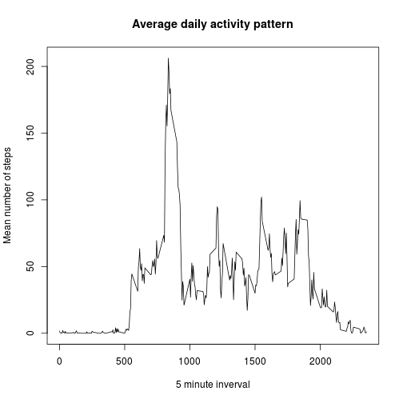

## Loading and preprocessing the data

ggplot2 is the only external library required.  All attempts were made to strictly use Base R.

```r
library(ggplot2)
```


1. Load the data (i.e. `read.csv()`)
2. Process/transform the data (if necessary) into a format suitable for your analysis


```r
# Get and load the data
unzip("activity.zip")
raw_activity <- read.csv("activity.csv")
```


```r
# Clean it up. NA's can be ignored.
activity <- na.omit(raw_activity)
activity$date <- as.Date(activity$date, "%Y-%m-%d")
steps_per_day <- aggregate(activity$steps, by=list(activity$date), FUN=sum)
avg_steps_per_day <- aggregate(activity$steps, by=list(activity$date), FUN=mean)
names(steps_per_day) <- c("day", "steps")
names(steps_per_day) <- c("day", "steps")
```


## What is mean total number of steps taken per day?

1. Make a histogram of the total number of steps taken each day
2. Calculate and report the **mean** and **median** total number of steps taken per day


```r
mean_steps <- mean(steps_per_day$steps)
median_steps <- median(steps_per_day$steps)

hist(steps_per_day$steps, xlab = "Steps per Day", main = "Frequency of Steps per Day", 
     col = "orange")
```

 

The mean steps taken per day is **10,766.1886792453** and the median **10,765**.


## What is the average daily activity pattern?

1. Make a time series plot (i.e. `type = "l"`) of the 5-minute interval (x-axis) and the average number of steps taken, averaged across all days (y-axis)
2. Which 5-minute interval, on average across all the days in the dataset, contains the maximum number of steps?


```r
avg_steps_per_interval <- aggregate(activity$steps, by=list(activity$interval), FUN=mean)
names(avg_steps_per_interval) <- c("interval", "avg_steps")

plot(avg_steps_per_interval$avg_steps ~ avg_steps_per_interval$interval,
     xlab = "5 minute inverval", ylab = "Mean number of steps", type = 'n', 
     main = "Average daily activity pattern")
lines(avg_steps_per_interval$avg_steps ~ avg_steps_per_interval$interval)
```

 


```r
max_interval <- avg_steps_per_interval$interval[avg_steps_per_interval$avg_steps == 
                                                  max(avg_steps_per_interval$avg_steps)]
```

The 5-minute interval which has on average across all the days in the dataset the maximum number of steps is **835**.


## Imputing missing values

1. Calculate and report the total number of missing values in the dataset (i.e. the total number of rows with `NA`s)
2. Devise a strategy for filling in all of the missing values in the dataset. The strategy does not need to be sophisticated. For example, you could use the mean/median for that day, or the mean for that 5-minute interval, etc.
3. Create a new dataset that is equal to the original dataset but with the missing data filled in.
4. Make a histogram of the total number of steps taken each day and Calculate and report the **mean** and **median** total number of steps taken per day. Do these values differ from the estimates from the first part of the assignment? What is the impact of imputing missing data on the estimates of the total daily number of steps?


```r
total_missing <- sum(!complete.cases(raw_activity$steps))
```

There are **2304** rows with missing data (i.e. NA)


```r
# Impute data by interval
imputed_activity <- merge(raw_activity, avg_steps_per_interval, by="interval", all=TRUE)
imputed_activity$steps[is.na(imputed_activity$steps)] <- imputed_activity$avg_steps[is.na(imputed_activity$steps)]  
imputed_activity <- subset(imputed_activity, select = -avg_steps)
imputed_activity <- imputed_activity[c("steps", "date", "interval")] #reorder
imputed_activity <- imputed_activity[with(imputed_activity, order(date, interval)), ] #sort
rownames(imputed_activity) <- seq(length=nrow(imputed_activity))  #reset rownames

imputed_activity$date <- as.Date(imputed_activity$date)

steps_per_day2 <- aggregate(imputed_activity$steps, by=list(imputed_activity$date), FUN=sum)
names(steps_per_day2) <- c("day", "steps")

hist(steps_per_day2$steps, xlab = "Steps per day", main = "Frequency of Steps per Day with Imputed values", 
     col = "orange")
```

 

The **imputed_activity** data set is equivelant to the original data but with missing data filled in.


```r
mean_steps2 <- mean(steps_per_day2$steps)
median_steps2 <- median(steps_per_day2$steps)
```

The mean is unchanged (**10,766.19**) but the median has now moved (**10,766.19**) to the mean.

## Are there differences in activity patterns between weekdays and weekends?

1. Create a new factor variable in the dataset with two levels -- "weekday" and "weekend" indicating whether a given date is a weekday or weekend day.
2. Make a panel plot containing a time series plot (i.e. `type = "l"`) of the 5-minute interval (x-axis) and the average number of steps taken, averaged across all weekday days or weekend days (y-axis). The plot should look something like the following, which was created using **simulated data**:


```r
imputed_activity$week <- ifelse(weekdays(imputed_activity$date) %in% c("Saturday", "Sunday"), "weekend", "weekday")

avg_weekend_activity <- aggregate(. ~ interval+week, data=imputed_activity, FUN=mean)

p <- ggplot(data = avg_weekend_activity, aes(x = interval, y = steps)) +  
  labs(x="Interval", y="Average Number of Steps", title="Average steps taken (Weekends versus Weekdays)") + 
  geom_line() + 
  geom_smooth(method = "loess")
p + facet_wrap(~week, ncol = 1)
```

 

There are differences in the daily activity patterns between weekdays and weekends.  Weekedays tend to have more activity earlier but drops off shortly after.  Weekends tend to have more activity throughout the day.
